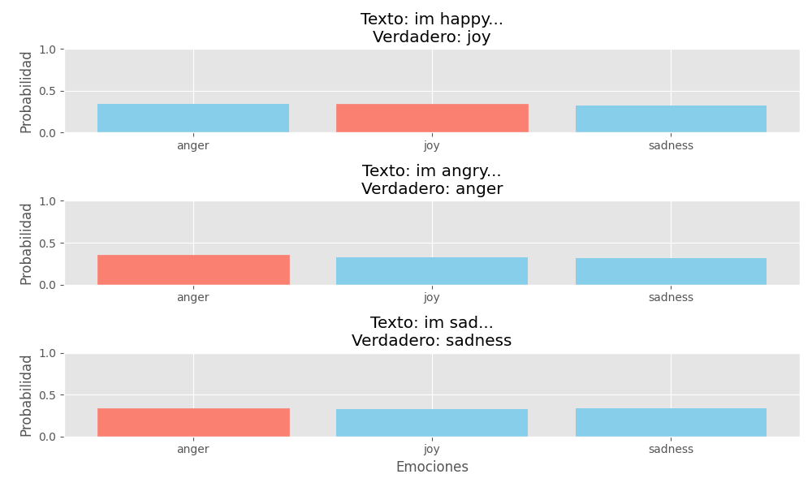
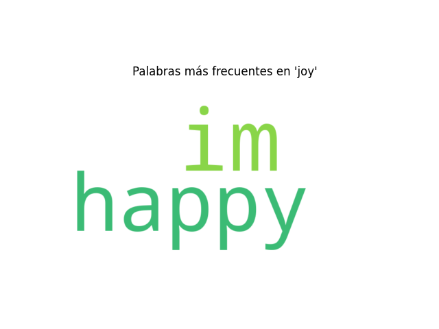
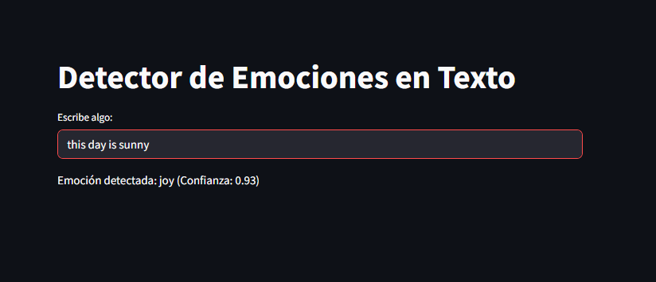

# Emotion Detection from Text Using Deep Learning
**Results Link:** [GitHub - Emotion Detection](https://github.com/your_username/emotion-detection)

## Objective
Develop a deep learning model to detect human emotions based solely on text input. The system aims to analyze the emotional tone of written text, making it useful for applications such as customer service, sentiment analysis, and interactive content.

## Key Features
- **End-to-End Pipeline:** Data preprocessing, model training, and real-time emotion detection from text.
- **Real-World Dataset:** Publicly available emotion datasets (e.g., Emotion-Stance Dataset, TextEmotion).
- **Real-Time Detection:** Emotion recognition in real-time from user-provided text.
- **Performance Metrics:** Accuracy, precision, recall, F1-score.
- **Text-based Emotion Detection:** Analyzes the sentiment of text to classify emotions.

## Technical Implementation
- **Language:** Python 3
- **Core Libraries:**
  - `TensorFlow/Keras`: Deep learning model training (LSTM, Transformer)
  - `NLTK/spaCy`: Text preprocessing (lemmatization, tokenization, stopword removal)
  - `NumPy/Pandas`: Data manipulation and analysis
  - `Matplotlib/Seaborn`: Visualization of results and metrics
  - `Streamlit`: Web interface for real-time emotion detection from text

## Dataset
- **Source:** [TextEmotion Dataset](https://www.kaggle.com/datasets/jillanisoft/text-emotion-detection)
- **Structure:**
  - **TextEmotion Dataset:**
    - Text data labeled with emotions: Happy, Sad, Angry, Fear, Surprise, Disgust, etc.

## Core Mechanics

### Preprocessing
- Tokenize and preprocess text (lowercasing, stopword removal, lemmatization)
- Use TF-IDF or word embeddings (GloVe, Word2Vec) for feature extraction

### Model Training
- Train a deep learning model (LSTM, BiLSTM, or Transformer) to classify emotions based on text input
- Fine-tune models with hyperparameter optimization

### Real-Time Detection
- Input text (e.g., a sentence or a paragraph) is processed and classified in real-time for emotional tone

## Interactive App
- **Input:** Text input from the user (free-text)
- **Output:** Predicted emotion (e.g., Happy, Sad, Angry) with a confidence score

## Outputs Generated

  

*small_dataset_evaluation.png: Graph with examples of phrases and their detected emotions.* 

  

*wordcloud.png: Word cloud based on the identified emotional expressions from text.* 

  

*demo.png: Screenshot showing the running interface for real-time emotion detection from text.* 

